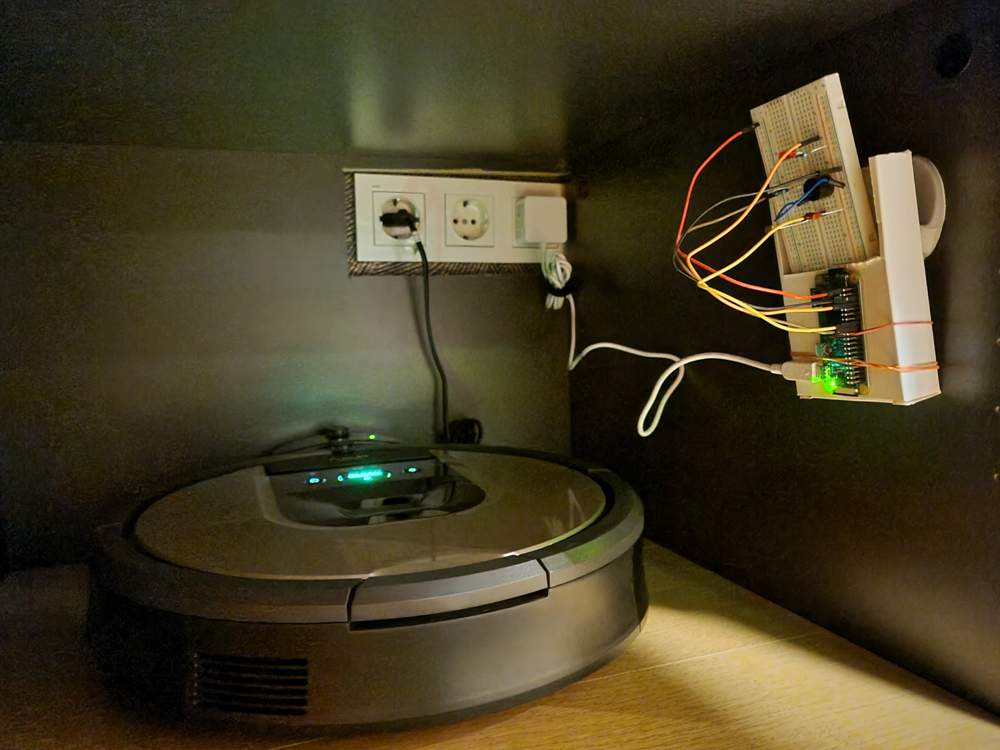

# Kraken Garage

Start iRobot automatically when the closet door is open, as detected by the light sensor.

Use case: you leave home on irregular schedule, so setting the fixed schedule for the iRobot doesn't work. Moreover, you iRobot is placed in a closet, so I open the door for it to break free when you leave, but then you forget to launch the job manully. Here comes the Kraken Garage: it will allow you to monitor the door and start Kraken automatically once it's open.

Here's my POC setup using Raspberry Pi Zero W and a breadboard:

Workflow:
1. Checks for the light sensor value every minute
2. If there is light, waits for another 10 minutes
3. If there is still light, starts the iRobot

Well, you can also replace the `start-kraken` script with whatever other thing you want to do on the similar condition.

Uses [Dorita980](https://github.com/koalazak/dorita980/) to interact with the iRobot.

## Prerequisites

* Raspberry Pi (Zero W) with nodejs installed (for Dorita980)    

Expected periphery:
* Distance sensor (HC-SR04) on GPIO pins 27 (trigger) and 14 (echo)
    * See https://gpiozero.readthedocs.io/en/latest/api_input.html#distancesensor-hc-sr04 for the correct connection instructions.
* LED on pin 9
* Buzzer on pin 22

## Setting up

Assuming the perifery is set up as above, no changes to the code are required.

Simply upload to your Raspberry Pi, configure garage-daemon to be started automatically on boot. Run `npm install` to install nodejs dependencies. If you're using NodeJS 18 or newer, extra manual acitons will be required, see below.

## Env variables

The following env variables are expcted by the start-kraken script:
* IR_BLID - iRobot BLID
* IR_PASS - iRobot password (NOT your iRobot account password!)
* IR_IP - (optional) iRobot IP address. If not specified, Dorita will try to discover it automatically

## Known issues

* For some reason, Dorita's auto-discovery stopped working for me at some point, so I have to specify the iRobot IP address explicitly. Your experience may vary
* Upstream version of Dorita980 doesn't work with the latest NodeJS, see https://github.com/koalazak/dorita980/pull/168. The version provided in the PR worked fine for me, just replace the contents of `node-modules/dorita980` with the patched version.
